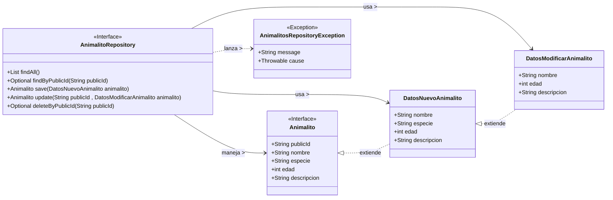

# Plan de trabajo para el proyecto de animales

1. Montar el API del Repositorio 
    interfaz: Animalito
    interfaz: AnimalitoRepository
2. Montar el proyecto de implementación
    - Montar las pruebas unitarias del Repositorio (H2 memory)
    - Montar la implementación JPA del Repositorio
    - Verificar que las pruebas pasan OK
3. Montar el API del controlador: OPENAPI SWAGGER
    - interfaz AnimalitoRestV1DTO + otras 2 o 3 DTOs
    - interfaces de las validaciones ( DTOS )
    - interfaz controlador, donde definamos el API REST: endpoints, verbos HTTP, códigos de respuesta, etc. (OPENAPI)
    - generar el openapi.yaml
4. Montar el proyecto de implementación del controlador
    - Montar las pruebas unitarias del controlador (Mocks)... y pruebas de integración (Spring Test WebMVC)
    - Montar los mappers (MapStruct)
    - Montar la implementación del controlador REST ---> API Servicio
    - ControlerAdvice (gestión de errores)
    - Pruebas de integración del controlador con la implementación del Servicio. Mockito para mockear el repositorio
5. Montar el API del Servicio
    - interfaz AnimalitoDTO + otras 2 o 3 DTOs
    - interfaz AnimalitoService
6. Montar el proyecto de implementación del Servicio
    - Montar las pruebas unitarias del Servicio (Mocks)
    - Montar la implementación del Servicio ---> API Repositorio
    - Montar los mappers (MapStruct)
    - Pruebas de integración del Servicio con la implementación del Repositorio (H2 memory)
7. Montar la aplicación principal
    - Configuración HTTP, Seguridad, etc.
    - Dare de alta los controladores REST (Hoy el de animales.. mañana quien sabe)
    - Montar pruebas de sistema (end2end) con Cucumber
---


# PASO 1: 1. Montar el API del Repositorio 

# Diagrama de clases 


## La excepción 

Puede ser lanzada por TODOS LOS MÉTODOS del repositorio.

## Validaciones para los campos de los animalitos.

- nombre: No nulo, no vacío, longitud mínima 2, longitud máxima 50, Capitalized (Primera letra mayúscula)
- especie: No nulo, no vacío, longitud mínima 3, longitud máxima 30
- edad: No nulo, valor mínimo 0, valor máximo 1000
- descripcion: Longitud máxima 500. Valor por defecto ""

Van en el API? TOTALMENTE!
Cómo las definimos?         Spring? JEE: Anotaciones custom : Creadas como  @interface?
                                        @NombreAnimalitoValido
                                        @EspecieAnimalitoValida
                                        @EdadAnimalitoValida
                                        @DescripcionAnimalitoValida
                                    Estandar: @NotNull, @Size, @Min, @Max, @Pattern, etc.


Para esto necesitaremos la dependencia spring-boot-starter-validation


DatosModificarAnimalito y DatosNuevoAnimalito son clases, no interfaces, ya que desde la capa superior (Servicio) necesitaremos instanciarlas para enviarlas al repositorio. Se lo ponemos código. Constructores a tutiplen y patrón Builder (Lombok)

# Dependencias?

spring-boot-core
spring-boot-starter-validation
lombok 


# Pregunta!

Las validaciones.. las usaremos solo esta capa de repositorio? O las usaremos también en la capa de servicio y controlador REST? En todas o al menos en otras seguro.

Vamos a crear un proyecto nuevo de Utilidades... donde por ahora pondremos las validaciones... y que podamos importarlas en las distintas capas.

Por supuesto el proyecto maven con módulos:

- animalitos
  modules:
    - animalitos-repo-api
    - animalitos-repo-impl
    - animalitos-service-api
    - animalitos-service-impl
    - animalitos-rest-api
    - animalitos-rest-impl
    - animalitos-common-utils
    - animalitos-app

---

SOLID:

Interface Segregation Principle (ISP) - Principio de Segregación de Interfaces
- Mejor tener muchas interfaces específicas en lugar de una sola interfaz general.
- No forzar a los clientes a depender de interfaces con métodos que no utilizan.
- Ejemplo: Si un cliente solo necesita un método de una interfaz, no debería verse obligado a implementar todos los métodos de esa interfaz.
- Ejemplo2: Si un cliente no necesita un puñetero dato.. pa' que se lo pongo, pa despistar!

---

SoC: Separation of Concerns - Separación de Preocupaciones


---

CONTINUACION, SEGUNDA PARTE:
Implementación de la capa de repositorio (Repository Layer)
------------------------------------------------------------------------------------
Nuestra implementación va a ser con una BBDD relacional mediante JPA.


1º Test. No vamos a escribir ni una implementación hasta que no hagamos las pruebas.
   Necesitamos el starter de test y el de JPA en el pom.xml del módulo
   Con respecto a las pruebas, usaremos una bbdd en memoria H2.

   Para las pruebas (unitarias), vamos a seguir principios FIRST
    - Fast
    - Independent
    - Repeatable
    - Self-validating
    - Timely
   Por ejemplo: EliminarAnimalito:
    // Dado
        Dados los dados de un animalito . Datos válidos
        Y dado que guardo previamente ese animalito en el repositorio
        Y Dado que capturo el publicId generado por el repositorio
    // Cuando
        Pido que se borre el animalito por su publicId
    // Entonces 
        Compruebo que el animalito ya no existe en el repositorio
        Y me aseguro que el animalito borrado es el que me ha sido devuelto
        // Con todos sus datitos
2º Implementación del repositorio
   - Utilizar el Spring Data JPA Repository
   - Montar una Entidad llamada AnimalitoEntity (que debe implementar la interfaz Animalito)
  

---

TERCER PASO:
# Capa del Controlador. API

Es menos habitual encontrar interfaces en esta capa, 
pero en aplicaciones más complejas puede ser útil definir interfaces para los controladores REST. 
Esto permite separar la definición de la API de su implementación, 
facilitando pruebas unitarias y promoviendo una arquitectura más limpia.

COJONUDO.. Y Además documentar el puñetero API con Swagger/OpenAPI
En el api, vamos a definir:

DTOs:
- AnimalitoRestV1DTO
- DatosNuevoAnimalitoRestV1DTO
- DatosModificarAnimalitoRestV1DTO
Usando las mismas validaciones que en la capa de repo.

AnimalitosRestV1Controller.java <--- interfaz
- /api/v1/animalitos
  - GET / -> listarAnimalitos
  - GET /{publicId} -> obtenerAnimalitoPorPublicId
  - POST / -> crearAnimalito
  - PUT /{publicId} -> modificarAnimalito
  - DELETE /{publicId} -> borrarAnimalito
Y ahí, además de las anotaciones de Spring Web para Mapping, vamos a meter TODAS LAS anotaciones de documentación de Swagger/OpenAPI.  
En esa documentación, que deberá ir también en los DTOs, pondremos también los casos de error (400, 404, 500, etc) y sus respuestas.

El resultado de esta capa es, además de las interfaces de los controladores REST,
la generación automática de la documentación de la API REST: openapi.yaml o openapi.json
Lo que haremos es que la generación de la documentación se haga cuando se ejecute un mvn verify


PASO CUARTO !!!!!


```java

    private AnimalitosService animalitosService;

    public ResponseEntity<AnimalitoRestV1DTO> borrarAnimalito(@PathVariable String publicId){
        try {
            Optional<AnimalitoDTO> animalitoBorradoOpt = animalitosService.deleteByPublicId(publicId);
            if (animalitoBorradoOpt.isPresent()) {
                AnimalitoDTO animalitoBorrado = animalitoBorradoOpt.get();
                AnimalitoRestV1DTO animalitoRestV1DTO = AnimalitoRestV1Mapper.INSTANCE.animalitoDTOToAnimalitoRestV1DTO(animalitoBorrado);
                return ResponseEntity.ok(animalitoRestV1DTO); // 200
            } else {
                return ResponseEntity.notFound().build(); // 404 Not Found
            }
        } catch (Exception e) {
            return ResponseEntity.status(HttpStatus.INTERNAL_SERVER_ERROR).build(); // 500 Internal Server Error
        }

    }
```

Eso me deja un código muy complejo de seguir.
Me interesa en esta clase tratar los happy path.. y que los errores los gestione otro componente: ControllerAdvice o un RestControllerAdvice. Una de las cosas que nos permite Spring: Programación orientada a aspectos (AOP)

Qué es eso Programación Orientada a Aspectos (AOP)????
Eso es otro patrón de diseño que nos permite separar las preocupaciones transversales (cross-cutting concerns) de la lógica principal de la aplicación. Básicamente se pare mucho a los patrones de diseño Decorator y Proxy.

Lo que se hace es envolver la llamada a este método en otro componente que se encarga de capturar las excepciones y devolver las respuestas HTTP adecuadas.

Lo que quiero acabar es con mi fichero del controlador asi:

```java

    private AnimalitosService animalitosService;

    public AnimalitoRestV1DTO borrarAnimalito(@PathVariable String publicId){
            Optional<AnimalitoDTO> animalitoBorradoOpt = animalitosService.deleteByPublicId(publicId);
                AnimalitoDTO animalitoBorrado = animalitoBorradoOpt.get();
                AnimalitoRestV1DTO aimalitoRestV1DTO = AnimalitoRestV1Mapper.INSTANCE.animalitoDTOToAnimalitoRestV1DTO(animalitoBorrado);ç
                return animalitoRestV1DTO;

    }
    ```

