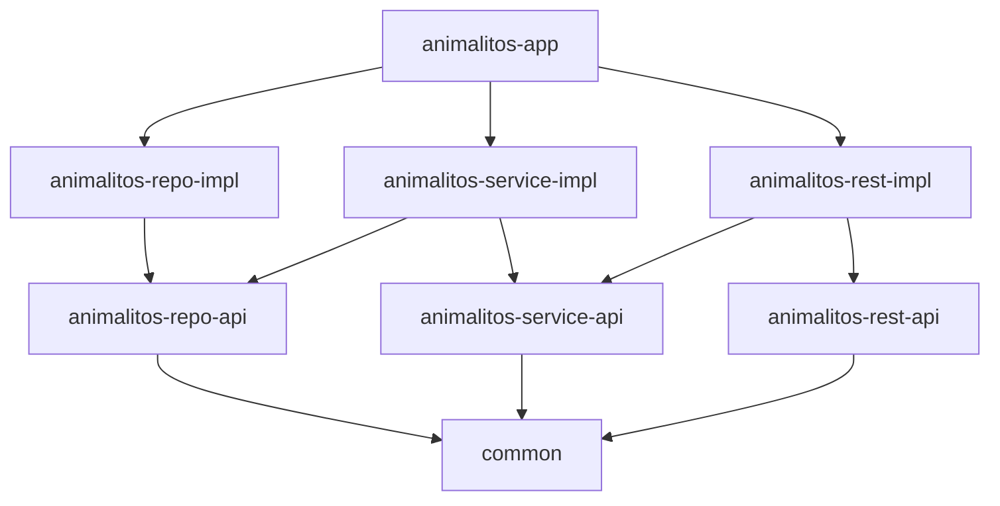

# WebFlux

    Microservicio1 ----> asinc------> Microservicio2
                KAFKA/RabbitMQ,Activemq
                Sistema de mensajería asincrona
                Whatsapp de las apps


Lo que me ofrece es programación reactiva, no bloqueante, asincrona.

                            Servidor de apps (TOMCAT,JBOSS,WEBLOGIC, JETTY)
Clientes                    QUEUE <> ThreadPool <- Funciones de mis controladores, servlets, jsp
- Cliente1                   4>3>2>1        2 - Hilo1 (1.. y se pone a trabajar)...
- Cliente2                                    - Hilo2 (2.. y se pone a trabajar)
- Cliente3
- Cliente4

Y ahora imaginad que el hilo 1, el el trabajo que está ejecutando, tiene que hacer una query a bbdd.
Y lanza la query? Cuanto tiempo tarda eso en resolverse?  IDA A LA BBDD , VUELTA DE LA BBDD  (paseillo = latencia) + tiempo query... depende tu query
    Puede ser desde 100ms a 3 segundos... o más
    Y que hace el hilo 1? ESPERA... y mi máquina con la CPU a 0%... aburrida... como el cliente 3 y el 4..
    Tiene sentido esto? NINGUNO. Tenemos un wait() y ese es bloqueante.

    Y ese espera es lo que destroza la escalabilidad de las aplicaciones web tradicionales.
    La única forma de escalar es? Más hilos... pero eso tiene un límite... no puedo abrir infinitos hilos.. un hilo consume un buen cacho de ram.Y si quiero abrir 1000 = 1000 x un buen cacho de ram... Un cacho enormemente grande de ram...

    Necesitamos una alternativa a esta forma de trabajo que tiene : TOMCAT, JETTY, JBOSS, WEBLOGIC... SERVIDORES DE APLICACIONES TRADICIONALES

Donde podemos tener estos problemas?
- Accesos a bbdd
- Llamadas a otros servicios REST
- Accesos a sistemas de ficheros lentos

Si el proceso es interno en mi máquina y purita CPU... no hay waits... y esto no aporta nada!
WebFlux (que se base en el project reactor - Mono, Flux-) nos ofrece una forma de programar alternativa a los hilos de ejecución tradicionales.
Project Reactor es del año 2016.... cuando en JAVA no había nada para gestionar mejor la asincronía...

JAVA de por si, ya tiene hoy en día una forma de lidiar con esto: Virtual Threads (JAVA 19+)

Es una reimplementación completa del modelo de hilos de ejecución en JAVA.
Los virtual threads son hilos de ejecución ligeros, de los que puedo llegar a abrir millones en una máquina.
Y esto es activable en Spring Boot 3.x con JAVA 21+


```
spring-boot:
  jvm:
    virtual-threads: true
```

Y esto ya me resuelve la mayor parte de los problemas de escalabilidad en aplicaciones web tradicionales.
Haciendo que webFlux empiece a tener poco sentido!

Solo en algunos casos, WebFlux si me ofrece algo más de escalabilidad que los virtual threads. ... pero no tantos.
Y eso si... las limitaciones que me impone el uso de webflux son enormes!
Lo primero REQUIERE Que es el Stack completo sea no bloqueante, asincrono y reactivo.

Al trabajar con webFlux, vamos a seguir teniendo unos cuantos hilos de ejecución (muchos menos que con los servidores tradicionales)
Y cuando un hilo tiene que hacer una operación que puede ser lenta (query a bbdd, llamada a otro servicio REST, acceso a ficheros lentos)
En lugar de bloquearse y esperar, lo que hace es registrar una callback (una función) que se ejecutará cuando la operación haya resultado.
Y mientras tanto el hilo vuelve al pool de hilos para atender otras peticiones.

Lo que va a cambiar, a nivel del código es que en los endpoints de mis controladores REST, en lugar de devolver objetos directamente, voy a devolver Mono<T> o Flux<T>

Básicamente si solo devuelvo un objeto simple: Mono<T>     ResponseEntity<AnimalitoRestV1DTO> -> ResponseEntity<Mono<AnimalitoRestV1DTO>>
Si devuelvo una colección de objetos: Flux<T>              ResponseEntity<List<AnimalitoRestV1DTO>> -> ResponseEntity<Flux<AnimalitoRestV1DTO>>

Los datos van envueltos en un Mono o en un Flux.
Y esos objetos me permiten registrar callbacks que se ejecutarán cuando los datos estén disponibles.
En el caso de los flux, cada vez que llega un nuevo dato, se ejecuta la callback registrada. Y puedo ir procesando las cosas que tengo que mandar al cliente de 1 en 1.... y no todas de golpe.

NO VA HABER MEJORA NINGUNA EN RENDIMIENTO... de hecho hasta puede empeorar el rendimiento debido a la sobrecarga de gestionar los Mono y Flux.
Lo que tengo es la capacidad de atender a mucha más gente en paralelo, con menos hilos de ejecución.

LO PRIMERO QUE NECESITO DETERMINAR es si realmente tengo un problema de escalabilidad en hilos de ejecución.
Si no lo tengo, no necesito webFlux para nada... mi app iría más lenta!

- Si no genero cola larga... me olvido de webFlux
- Si genero cola larga... miro y puedo ampliar hilos tradicionales, me olvido de webFlux
- Si genero cola larga... y no puedo ampliar hilos tradicionales... pero puedo usar virtual threads... me olvido de webFlux
- Si genero cola larga... y no puedo ampliar hilos tradicionales... ni usar virtual threads... o teniendo ya un huevo de virtual threads... sigo generando cola larga... entonces si, uso webFlux... y me temo que en muy poquitas apps para muy poquitas cosas voy a necesitar webFlux.


NETTY: Servidor no bloqueante, asincrono, reactivo.
Para usar esto, necesito una BBDD no bloqueante, asincrona, reactiva 
con drivers de bbdd reactivos (no jdbc)... ni con jpa... un poquito de jpa tendremos.. pero hiperlimitado.. ni un join @OneToMany, etc...
MongoDB (NoSQL) + Spring Data MongoDB reactivo

JS? 

Admite hilos de ejecución? NO
Y tiene tareas asíncronas? SI... y como async/await!
JS se basa en loops de eventos (event loops)
Un hilo de ejecución que va gestionando eventos y tareas asíncronas.

Y Algo parecido es lo que hace webflux en el servidor.


---

# Qué tenemos:

Tenemos una app web (un servicio Rest crud) que gestiona animalitos.

End points: 
| GET | `/api/v1/animalitos/{publicId}` | Obtener animalito por su ID público |
| GET | `/api/v1/animalitos` | Listar todos los animalitos |
| POST | `/api/v1/animalitos` | Crear nuevo animalito |
| PUT | `/api/v1/animalitos/{publicId}` | Modificar animalito existente |
| DELETE | `/api/v1/animalitos/{publicId}` | Eliminar animal

De los animalitos, los datos que trabajamos son:
- id: Id interno (Long) NO LO EXPONEMOS
- publicId: String (UUID)
- nombre: String
- especie: String
- edad: Integer
- descripción: String

## Arquitectura

Seguimos una arquitectura limpia, con las siguientes capas:

proyecto:/

└── common/                  # Código común (validaciones de los campos de los animalitos)
└── animalitos-repo-api/      # Definición de repositorios / DAO
└── animalitos-repo-impl/     # Implementación de repositorios trabajando con JPA / Entidades
└── animalitos-service-api/   # Definición de servicios
└── animalitos-service-impl/  # Implementación de servicios
└── animalitos-rest-api/      # Definición de la API REST (DTOs, interfaces)
└── animalitos-rest-impl/     # Implementación de la API REST (controladores, mapeos)
└── animalitos-app/           # Aplicación Spring Boot que arranca el servicio REST

# Esquema de dependencias:



En cada capa de implementación:
- Repo: Implementación de repositorios JPA (H2, Hibernate)
- Service: Implementación de servicios de negocio (MapStruct)
- Rest: Implementación de la API REST:
  - Un controlador Animalitos
  - RequestMappings de los endpoints a las funciones del servicio
  - Todo el control de excepciones se hace mediante un @ControllerAdvice global en la app principal

Todo ello además con lombok, jakarta validation, openapi, etc.
Además, pruebas unitarias, de integración y de sistema, donde toca.

# Qué problema podría haber ahora, para necesitar pasar esto que tenemos a WebFlux?

El problema es efectivamente que tengamos muchos hilos bloqueados (NO SON LOS THREAD STUCK del weblogic)... pero eso es un problema realmente? NO ES UN PROBLEMA.
Es lo normal. Si lanzo una petición a una BBDD, el hilo que la lanza se queda WAITING... esperando la respuesta de la BBDD (BLOQUEADO)
El problema es que deje de tener hilos en el pool para atender nuevas peticiones, mientras la cpu está con margen para atender más carga!

El problema adicional es que no tenga RAM libre. Si tengo RAM libre, que tengo que hacer? lanzar más hilos! Aumento el tamaño del pool de hilos.
La cosa es que esto llega a su límite. Y NO ES FACIL LLEGAR A ESE LÍMITE.

Qué hacemos ahí?
3 opciones:
1. Más hardware. Escalado en horizontal (más máquinas) o vertical (máquinas más potentes)... fuerza bruta.. y más pasta!
2. Usar Virtual Threads (JAVA 21+ y Spring Boot 3.x). 2 propiedades en el fichero de configuración de spring boot.
   Esto es razonablemente nuevo. Y es algo que tenemos a nivel la jvm.
   Ahora ... cuidado! Si no tenía RAM, aunque la estructura de los hilos me ocupe mucho menos, si son virtuales, los trabajos que se sean ejecutando en ellos, siguen consumiendo RAM (datos). Me quito de la sobrecarga en RAM que me genera el trabajar con hilos reales. Potencialmente puedo abrir muchísimos más hilos, eso si.. ojito a la RAM... mucho más hilos, (aunque sean virtuales) más datos en RAM.
    
    Problema adicional! LA BBDD
    Si mi app trabaja contra una BBDD... cuidao!


                          App Server
                          ---------------------------------------------------------------------------------------------------------->
    Clientes > peticiones > cola < Threads Pool < Hilos ejecutando peticiones > ... y como parte del trabajo: QUERY! (conexión) > cola de conexiones < pool de conexiones 
                                    físicos  (500/1000) o
                                    virtuales (muchísimos más: 10.000s)

  Si subimos sin más el thread pool de ejecución, podemos llegar a saturar el pool de conexiones a la BBDD... y que las peticiones pasen a encolarse en la cola de conexiones a la BBDD... y volvemos a tener el mismo problema.

  Necesitaría subir también el pool de conexiones a la BBDD... de qué depende eso? DEL HARDWARE que tengo en la BBDD

  Las BBDD no funcionan ni parecido a como funcionan las apps web o los we app servers.

  En un webapp Server, una conexión a la BBDD se ejecuta en un hilo de ejecución. Si tengo 3 conexiones, tengo 3 hilos de ejecución.
  Si aumento a 200 conexiones, necesito 200 hilos de ejecución. 1 hilo por conexión.

  En una BBDD una nueva conexión es un nuevo proceso a nivel de SO... no un hilo de ejecución dentro de un proceso global de la BBDD.
  Cada conexión que hago contra un oracle, mariadb, postgresql, etc... es un nuevo proceso a nivel de SO.

  Si abrir hilos, implica un sobrecosto en RAM... abrir procesos ... flipas!
  De hecho lo primero que tengo que hacer a nivel de SO para abrir un proceso es poner una copia del programa en RAM.
  Y si abro 200 conexiones a la BBDD... tengo 200 copias del programa de la BBDD en RAM... y eso consume un huevo de RAM.
  El sobrecoste de una conexión a la BBDD es enorme en el servidor de BBDD. En el webapp server es pequeño (hilos) pero en la BBDD es enorme (procesos).

  Cada conexión, mientras no se hace commit, guarda una copia de los datos enteros que se estén modificando en RAM... en su RAM... y si son muchas conexiones, la RAM de la BBDD se puede saturar rápidamente. Los datos permanentes (commiteados) se guardan en un proceso global de la BBDD en memoria RAM, a la que los otros procesos (conexiones) acceden para leer datos (shared memory a nivel de SO). Pero cada conexión tiene su propia RAM para guardar los datos temporales (no commiteados) + una copia completa del programa de la BBDD. Es una locura!
  Y a nivel de las BBDD, los administradores de BBDD son muy reacios a subir el número de conexiones máximas permitidas en la BBDD... porque saben lo que eso implica a nivel de RAM en el servidor de BBDD.

  Y una BBDD necesita un huevo de memoria ram. El servidor de BBDD si puede pone la BBDD entera en RAM (CACHE)


  En cualquier BBDD de producción una vez llega una peticion que hace modificacion de datos, lo primero se guarda en el WAL (write ahead log) ... Archive log en oracle... y se hace flush a disco cada bastante poco tiempo. Y hasta que esto no está hecho, no se da por bueno el commit.
  Esa operación es muy rápida: Append a fichero + flush a disco.
  El problema es cuando se haga efectivo el insert! No es solo añadir al culo de un fichero... lo que es fácil.
  Los datos se guardan en páginas de datos (8Kbs), que se leen o escriben enteras. Además, vienen las actualizaciones de INDICES... Es un desparrame.. eso se hace después del commit!

  Los ficheros querríamos solo usarlos para PERSISTENCIA... no para atender peticiones.
  Una BBDD ideal, al arrancar pone la BBDD en memoria y no vuelve a tocar el disco para SELECTS
  Es más hasta el resultado de los selects lo guardo en RAM, para no tener ni que volver a calcularlo. 
  Las BBDD hacen un uso extraordinario de la RAM (CACHE) para evitar tocar el disco o usar cpu.


  Dependiendo de lo que haga mi app, me puede interesar más o menos usar virtual threads.
  Otro ejemplo. Mi app tira mucho de HDD. Va a haber mucho rato que un hilo esté bloqueado esperando a que el HDD le devuelva /escriba datos (uso intensivo de IO).. el hilo ahí no hace nada... solo espera a que acabe el IO.
  Si tengo virtual threads, puedo abrir muchos más hilos que con hilos tradicionales... y me interesaría? El problema es que de nuevo peto el HDD Si tenía la presión de HDD alta ya... ahora flipas... el disco lo revientas. Y empieza con errores de SO.. disco no disponible (timeouts en la cola de acceso al disco)

  Es decir.. al final, siempre hay alguien que paga las consecuencias del aumento de la carga soportable:
  - BBDD (que me cortarán.. y lo pagaré yo con peticiones encoladas - timeouts) en el pool de conexiones a la BBDD
  - Disco (que tiene su límite de accesos concurrentes) y me cortarán (timeouts)
  - Red (me estoy comunicando con 3 microservicios más... y la red tiene su límite envío)

Esto no es tan fácil, como decir, subo hilos y punto pelota. Puedo agravar mucho el problema.

Estas decisiones afectan a configuraciones de todo el stack tecnológico.... incluso pueden afectar a hardware (más RAM, discos SSD, etc)

3. Otra solución a este problema es usar WebFlux: Se basa en un concepto llamado Programación Reactiva.
  
   Necesito aquí un stack completo reactivo, no bloqueante, asincrono. En cuanto una pieza no soporta, vuelvo a generar un punto de bloqueo!
   Sistemas de mensajería especiales... BBDD especiales, drivers especiales, servidores app especiales, etc.

Cuando me meto en este charco, lo primero es un análisis muy muy profundo del estado REAL de mi aplicación y de todo el stack tecnológico que la soporta.

Necesito ver dónde está el cuello de botella real.
Si tengo muchos hilos bloqueados, necesito ver por qué.
Y si están bloqueados a nivel de BBDD, tengo muchos hilos de mi pool de ejecutores bloqueados esperando en la cola de conexiones a la BBDD?
Aumentar el tamaño del pool de ejecutores => más esperas en esa cola.
Lo primero que necesito es aumentar el pool de conexiones a la BBDD... 
  - Una forma es aumentar el hardware de la BBDD (más RAM, discos SSD, etc) + configuración de la BBDD (más conexiones máximas permitidas)
  - Otra forma es usar una BBDD y un driver reactivo (no bloqueante, asincrono) como MongoDB + MariaDB + Spring Data MongoDB reactivo.
    Aquí no tengo pool de conexiones... las conexiones son virtuales y puedo abrir muchísimas más conexiones sin problema.

    Y el hecho es que, cuando tiro una query con un modelo tradicional, si la query devuelve 500 registros, el hilo que la lanza se queda bloqueado esperando a que la BBDD le devuelva los 500 registros. Y lo primero que necesito es en la BBDD tener esos 500 registros preparados para ser enviados (en RAM)
    Y en el web app server, el hilo que lanza la query está bloqueado esperando a que la BBDD le devuelva los 500 registros.. y necesito en hueco en la RAM para guardar esos 500 registros.

    En cambio, si uso un driver reactivo, el hilo que lanza la query no se bloquea esperando a que la BBDD le devuelva los 500 registros.
    Ni la BBDD tiene que preparar los 500 registros para enviarlos de golpe.
    La BBDD va enviando registros según los vaya leyendo (de ram o de disco)
    Y el hilo que lanzó la query, cada vez que llega un nuevo registro, se despierta, procesa el registro y vuelve a pool esperando al siguiente.
    No necesito espacio para los 500 registros en RAM... solo para 1 paquete de registros

---

Con WebFlux y programación reactiva NO GANO NADA EN RENDIMIENTO, es más suele empeorar.
Lo que gano es en escalabilidad, en poder atender a más peticiones concurrentes con menos hilos de ejecución.


Un sistema que tarde 1000ms en atender a una petición, con webflux, es fácil que tarde 1300ms.
No va a hacer que vaya más rápido... al contrario, irá seguro más lento.

Lo que gano es que mientras el primer sistema era capaz de procesar peticiones de 100 en 100, porque tenía 100 hilos de ejecución, el sistema con webflux puede atender peticiones de 300 en 300, con solo 30 hilos de ejecución.
Cada petición tardará más, pero el sistema en global atenderá a más peticiones concurrentes.

---

En muchos casos, no necesito nada de esto!
En muchos otros casos, con virtual threads (JAVA 21+ y Spring Boot 3.x) ya tengo suficiente.
Y en algunos pocos casos, necesito webflux.... cuidado! no para implementar una app entera... sino para implementar solo las partes que realmente lo necesiten.

Enm nuestro sistema... quizás solo la parte de get_all_animalitos... que puede devolver muchos registros... y el resto de endpoints, con virtual threads, sio acaso!.


WebFlux se basa en una librería JAVA llamada Project Reactor, que a su vez es una implementación en JAVA del estándar de programación reactiva: Reactive Streams <- Estandar!

Hay implementaciones de este estándar en otros lenguajes:
- RxJS (Javascript) (subscriptions, observables)


Promise ----> Observable (RxJS)
1 potencial     una secuencia de
valor futuro    potenciales valores futuros

Eso mismo es lo que hace Project Reactor en JAVA:

Mono<T> ----> Flux<T>
  ~
Future<T>   
 1 potencial
 valor futuro

 Esta implementación del Future<T> de java no es programanción reactiva.... es solo asincronía.
 Mientras que Mono<T>, además de ser asincrono, es reactivo, no bloqueante.

---

Programación asincrona.... Lanzo un trabajo en paralelo y no espero la respuesta para seguir haciendo lo mio... Pero cuando necesito la respuesta, puedo optar por una estratggia bloqueante(no reactiva) o no (el no es reactivo):


```java

public interface Servicio {

    // Estrategia bloqueante (no reactiva)
    Future<Resultado> trabajoAsincronoBloqueante(Parametros params);

    // Estrategia no bloqueante (reactiva)
    Mono<Resultado> trabajoAsincronoNoBloqueante(Parametros params);

}


// Al usarlo:

public void algoQueNecesitoHacer() { // Ambas 2 son estrategias asincronas... solo que en la primera, al final, es necesario bloquearme esperando el resultado

    // Estrategia bloqueante (no reactiva)
    Future<Resultado> future = servicio.trabajoAsincronoBloqueante(params);
    // Hago otras cosas...
    ...
    // Cuando necesito el resultado:
    Resultado resultado = future.get(); // Aquí me bloqueo esperando el resultado (WAIT) BLOQUEO
    // Hago otras cosas que necesitan el resultado... No se ejecutarán hasta que no tenga el resultado

    // Estrategia no bloqueante (reactiva)
    Mono<Resultado> mono = servicio.trabajoAsincronoNoBloqueante(params);
    // Cuando tenga el resultado:
    mono.subscribe(resultado -> { // Dejho programado lo que debe ocurrir cuando exista el resultado
        // Hago otras cosas que necesitan el resultado... No se ejecutarán hasta que no tenga el resultado
    });
    ...
    // Hago otras cosas... a miles! incluso dejar el hilo libre para que atienda otras peticiones / requests de otros clientes

    // El poder aplicar programación reactiva depende no solo de mi, sino de todo el stack tecnológico que use.
    // El que sea que me suministra los datos, me los debe suministrar de forma reactiva (no bloqueante, asincrona)
    // en el caso de java, mediante Mono<T> o Flux<T>

    // Un driver JDBC o un repo JPA:
    // Animalito findById(Long id);  // BLOQUEANTE

    // Un driver de BBDD reactivo:
    // Mono<Animalito> findById(Long id); // NO BLOQUEANTE (REACTIVO)

    // Y entonces, yo en capa de servicio:

    public AnimalitoDTO getAnimalitoBloqueante(Long id) {
        // BLOQUEANTE
        Animalito animalito = repo.findById(id); // Aquí me bloqueo esperando el resultado (REPO JPA)
        return mapToDTO(animalito);
    }

    public Mono<AnimalitoDTO> getAnimalitoNoBloqueante(Long id) {
        // NO BLOQUEANTE (REACTIVO)
        Mono<Animalito> animalito = repo.findById(id)
        animalito.map(a -> mapToDTO(a)); // Oye animalito... cuando tengas el resultado, me haces el mapToDTO
        return animalito; // Pero el Mono<AnimalitoDTO> cuando lo devuelvo no incluye el resultado... solo la promesa de que habrá un resultado en el futuro
        // Y quien lo reciba (hilo del pool de hilos) podrá hacer otras cosas mientras tanto
        // habiéndole dejado programado lo que debe hacer cuando llegue el resultado :
        // animalito.subscribe(a -> // SE LO MANDAS AL CLIENTE en JSON en el HttpResponse) // Pero esto es algo que hace un WebAppServer REACTIVO como Netty (WebFlux)
    // En el mono luego podemos configurar no solo lo que debe pasar si se resuelve esa promesa.... sino también lo que debe pasar si hay un error:
        // animalito
        //    .map(a -> mapToDTO(a))
        //    .onErrorResume(e -> Mono.error(new MiExcepcionPersonalizada("No se ha podido obtener el animalito", e)));
}

```

---

# Streams de JAVA

```java

List<Integer> numeros = List.of(1,2,3,4,5,6,7,8,9,10);
numeros.stream()                        // Stream secuencial
    .filter(    n -> n % 2 == 0   ) // Filtrar pares ... Después de ejecutar esta línea que tengo? Una Lista con (2,4,6,8,10)?
    .map(       n -> n * n        ) // Elevar al cuadrado... Después de esta línea que tengo? Una Lista con (4,16,36,64,100)?
    .forEach(   n -> System.out.println(n)  ); // Imprimir

```
Ni parecido a eso! Si fuera así sería una ruina en términos computacionales, comparada con programación imperativa tradicional.
Eso sería que el código de arriba ejecuta 3 bucles... y eso no es lo que ocurre.
En los Streams, que solo son una implementación en JAVA de un modelo funcional de programación llamado MapReduce, las funciones de tipo Map (.map, .filter, etc) son funciones perezosas (lazy evaluation).
Las 2 primeras lineas solo han anotado junto con los datos originales, las operaciones que se deben hacer..
ES COMO SI EL FILTER DEVOLVIERA LA MISMA LISTA QUE LE LLEGA +`POSTIT PEGAO ENCIMA QUE DICE: "FILTRA PARES"
Y EL MAP DEVUELVE LA LISTA QUE LE LLEGA + POSTIT QUE LE HA LLEGADO Y PEGA ENCIMA OTRO POSTIT QUE DICE: "ELEVA AL CUADRADO"

Es la función forEach(función de tipo reduce) la que se ejecuta en modo EAGER EVALUATION (ansiosa) y la que desata el cálculo real de todos los postits pegados a los datos originales.

Esto mismo es lo que pasa con los Mono<T> y los Flux<T> de Project Reactor.

Alguien devuelve un Mono<T> o un Flux<T>... pero no hay ningún cálculo real detrás.
Y yo devulevo un Mono<T> o un Flux<T>... que lleva dentro la misma promesa de entregar algo, junto con un postit que dice: "Cuando tengas el resultado, haz esto con él antes de devolverlo al cliente"
Y el siguiente devuelve otro Mono<T> o Flux<T> con el mismo postit + otro postit que dice: "Cuando tengas el resultado, haz esto otro con él antes de devolverlo al cliente"

Promesa de un dato que llegará o NO + n notas pegadas que dicen lo que hay que hacer con el dato cuando llegue.

BBDD -> Mono<AnimalitoEntity>
Repo -> Mono<Animalito> = Mono<AnimalitoEntity> + postit (animalitoEntity2Animalito)
Service -> Mono<AnimalitoDTO> = Mono<AnimalitoEntity> + postit (animalitoEntity2Animalito) + postit (animalito2AnimalitoDTO) + envíes un email (animalitoDTO2Email)... pero más vale que esa función sea asíncrona y no bloquee el hilo... si no.. cuando sea que se ejecute ese trozo de código, el hilo se va a bloquear esperando a que el email se envíe... y eso no es reactivo!

Controlador REST -> Mono<AnimalitoRESTV1DTO> = Mono<AnimalitoEntity> + postit (animalitoEntity2Animalito) + postit (animalito2AnimalitoDTO) + postit (animalitoDTO2AnimalitoRESTV1DTO) + SI HAY ERROR : postit (manejarErrorYDevolver404)
^^^Y eso es capturado por Netty (WebFlux) que pone su capa (su positit)

netty dice:

Mono<AnimalitoRESTV1DTO> = Mono<AnimalitoEntity> + postit (animalitoEntity2Animalito) + postit (animalito2AnimalitoDTO) + postit (animalitoDTO2AnimalitoRESTV1DTO) + postit (manejarErrorYDevolver404) + postit (serializarAJSONYMandarAlCliente)


Los drivers de BBDD reactivos no soportan toda la API de JPA ... solo una parte, No tenemos joins con anotaciones @OneToMany, @ManyToOne, etc. Y esto puede ser muy limitante para algunas apps.
A veces me interesa desnormalizar datos para no tener que hacer joins desde JAVA

Todo esto lo montamos para cosas muy puntuales y muy concretas, que realmente tengan esta necesidad de escalabilidad en hilos de ejecución.


```java
List<Integer> numeros = List.of(1,2,3,4,5,6,7,8,9,10);
for (Integer n : numeros) {
    if (n % 2 == 0) {
        System.out.println(n * n);
    }
} // Aqui hay un bucle
```


---
YAML: es un lenguaje alternativo a XML o JSON

```yaml
# En un archivo puedo tener muchos documentos YAML separados por ----

clave1: valor1
clave2: valor2
...
# Pueden pasar 10 minutos
---
claveA: valorA
claveB: valorB
... # Marca de fin de documento
--- # Marca de inicio de documento
claveX: valorX
claveY: valorY

```


---


Juego de teléfono móvil: AJEDREZ / PARCHIS / CHAT
Empieza una partida:

App cliente móvil ---> Servidor Ajedrez        App contrincante móvil
                  reina                 ----->
                                        reina!
Yo saco una reina!
Yo tengo que comunicar al servidor, para que a su vez, lo comunique al otro jugador.
Le hago una petición http? NI DE COÑA. Imaginad que si... Y la otra comunicación? La del Servidor al app contrincante?

Entonces, que protocolo me interesa aquí? WebSocket (bidireccional, full duplex)

Y en el servidor... que dejo un hilo abierto? para la conexión de ese tio, que durará 30 minutos!

Aqui no es una petición http que se despacha y cierra en 1 segundo.
No puedo dejar un hilo por cada jugador procesando sus peticiones.
Lo que necesito es que por esos tubos que he dejado abiertos, vayan llegando mensajes... o saliendo mensajes... de una cola de mensajes.
Y tendré hilos que estén leyendo esas colas de mensajes y procesándolas. (Pool de ejecutores)

Esto es simple.. imaginad que en medio del proceso tengo que enriquecer los datos o hacer otra cosa con ellos.

En una cosa así, me puede interesar programación reactiva (WebFlux) REACCIONAR A los mensajes que van llegando.
Lo que hago es programar: Cuando llegue un mensaje, haz esto con él (POSTIT... una función!)
Por ejemplo:
-. Cuando llegue un mensaje de tipo "mover pieza":
1. valida que el movimiento es correcto (según las reglas del ajedrez)
2. cuando se haya validado, que se guarde en un sistema para futuros análisis (estadísticas, etc)
3. cuando se haya guardado, que se envíe el mensaje al contrincante
Y todo esto sin bloquear hilos de ejecución esperando a que cada paso se complete.
De forma que si se está enviando al sistema de analticas.. y tarda 20ms... en esos 20ms el hilo que estaba procesando ese mensaje, puede estar procesando otros mensajes de otros jugadores (hacer otras validaciones, solicitar otros guardados, enviar respuestas al contrincante, etc)
---


La primera vez que hemos ejecutado el código, vemos que tara 10-30 ms en preparar el mono
La segunda vez ya menos... qué pasa?

Lo que pasa es que ya está caliente el JIT (Just In Time Compiler) de la jvm.

Las apps JAVA requieren de un warm up time (tiempo de calentamiento)

JAVA es un lenguaje compilado a bytecode (código intermedio)
Ese bytecode es interpretado por la jvm (java virtual machine)

Y la interpretación se hace en tiempo de ejecución.. y lleva tiempo hacerla.
En Java 1.2 se añadió al JIT (Just in time compile.. el que interpreta) una funcionalidad llamada HotSpot.
Es una cache de compilaciones... de código ya interpretado.
El resultado de las interpretaciones se guarda en memoria RAM.
Cuando se vuelve a ejecutar un código que ya ha sido interpretado, el JIT lo saca de la cache y no tiene que volver a interpretarlo.
Y eso es mucho más rápido.

Nunca podemos medir el tiempo en java en la primera ejecución de un código. Un programa hay que calentarlo primero
Para poder medir tiempos reales, hay que ejecutar el código muchas veces (miles) y luego medir el tiempo medio.

Esa funcionalidad del JIT hace que una app Java hoy en día sea igual de rápida en rendimiento que una app compilada a código máquina nativo (C, C++)... menos la primera ejecución.