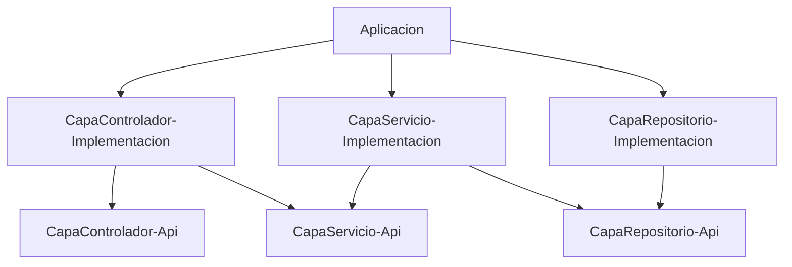

El tema lo tenemos en la comunicación que hay entre capas.

Capa-Controlador-ImplV1:
 @RequestMapping("/api/v1")
    AnimalitosControllerRestV1Impl implements AnimalitosControllerRestV1:
        @Autowired
        private AnimalitosService animalitosService;

        @GetMapping("/animalitos")
        public List<AnimalitoRestDTOV1> getAnimalitos() {
            return animalitosService.obtenerAnimalitos().map(mapper::Animalito2AnimalitoRestDTOV1);
        }

        @PostMapping("/animalitos")
        public AnimalitoRestDTOV1 crearAnimalito(@RequestBody AnimalitoRestDTOV1 animalito) {
            return mapper.Animalito2AnimalitoRestDTOV1(animalitosService.crearAnimalito(animalito));
        }

    class AnimalitoRestDTOV1 {
        private Long id;
        private String nombre;
        private String especie;
    }
    mapper Animalito2AnimalitoRestDTOV1(Animalito animalito) {
        AnimalitoRestDTOV1 dto = new AnimalitoRestDTOV1();
        dto.setId(animalito.getId());
        dto.setNombre(animalito.getName());
        dto.setEspecie(animalito.getSpecie());
        return dto;
    }

Capa-Controlador-ImplV2:
    @RequestMapping("/api/v2")
    AnimalitosControllerRestV1Impl implements AnimalitosControllerRestV1:
        @Autowired
        private AnimalitosService animalitosService;

        @GetMapping("/animalitos")
        public List<AnimalitoRestDTOV2> getAnimalitos() {
            return animalitosService.obtenerAnimalitos().map(mapper::Animalito2AnimalitoRestDTOV2);
        }

        @PostMapping("/animalitos")
        public AnimalitoRestDTOV2 crearAnimalito(@RequestBody AnimalitoRestDTOV2 animalito) {
            return mapper.Animalito2AnimalitoRestDTOV2(animalitosService.crearAnimalito(animalito));
        }
    class AnimalitoRestDTOV2 {
        private Long id;
        private String name;
        private String species;
        private LocalDate birthDate;
    }
    mapper Animalito2AnimalitoRestDTOV2(Animalito animalito) {      AUTOMAPPER
        AnimalitoRestDTOV2 dto = new AnimalitoRestDTOV2();
        dto.setId(animalito.getId());
        dto.setName(animalito.getName());
        dto.setSpecies(animalito.getSpecie());
        dto.setBirthDate(animalito.getBirthDate());
        return dto;
    }

    ^^^ Quien llama a estas funciones? Frontal / Servicio Web externo

Capa-Servicio-Api:
    AnimalitosService:
        public List<AnimalitoDTO> obtenerAnimalitos();
        public AnimalitoDTO crearAnimalito(AnimalitoDTO animalito);

Capa-Servicio-Impl:
    AnimalitosService:
        public List<AnimalitoDTO> obtenerAnimalitos() {
            //Apunto en un log
            //Mando un mail
            return animalitosRepositorio.findAll().
                .map(mapper::Animalito2AnimalitoDTO)
        }
        public AnimalitoDTO crearAnimalito(AnimalitoDTO animalito) {
            return mapper.Animalito2AnimalitoDTO(
                animalitosRepositorio.save(
                    mapper.AnimalitoDTO2Animalito(animalito)
                )
            );
        }

    class AnimalitoDTO {
        private Long id;
        private String name;
        private String species;
        private LocalDate birthDate;    
    }

    mapper Animalito2AnimalitoDTO(Animalito animalito) {
        AnimalitoDTO dto = new AnimalitoDTO();
        dto.setId(animalito.getId());
        dto.setName(animalito.getName());
        dto.setSpecies(animalito.getSpecie());
        dto.setBirthDate(animalito.getBirthDate());
        return dto;

Capa-Repositorio-Api:
    AnimalitosRepositorio:
        public List<Animalito> findAll();
        public Animalito save(Animalito animalito);

Capa-Repositorio-Impl:
    AnimalitosRepositorio extends JpaRepository<Animalito, Long> 

    @Entity
    class Animalito {
        private Long id;
        private String name;
        private String species;
        @Column(name = "birth_date", nullable = true)
        private LocalDate birthDate;
    }

// Llegan a los 3 meses... y dicen... Los nombres de las columnas de la tabla: En inglés

Si el día de mañana quiero liquidar al Oracle... y meter un MariaDB
Quién se come ese cambio? HIBERNATE (JPA)
Lo único que tengo que modificar es en el application.properties: Dialect
Cambiar el driver de conexión a BBDD

Qué pasa si el día de mañana quiero cambiar el MariaDB por un MongoDB? OSTIA TU !
Mongo ya no es JPA!

Por lo que .. debo cambiar la clase Animalito...
Quizás ya no tendré ni un ID Long... quizás tendré un String con un UUID

Cambio capa de repositorio.. y quién tiene un problema? La capa de servicio!

Si tuviera un mapper en la capa de repositorio... podría mapear de AnimalitoEntity a Animalito
Y el día de mañana mapear de AnimalitoDocument(MONGO)  a Animalito

Y quien se entera de que he hecho el cambio? NADIE (YO)

Tengo que meter mapper en capa de repositorio?
TU SABRAS?
- Te quieres atar a JPA? Entonces no
- No te quieres atar a JPA? Entonces SI

Puede ser que no quiera quitar el ORacle... pero quiera usar R2DBC (Reactive)
Entonces aquí tampoco tengo JPA?  Cago en la mar! salá!


Todo depende de lo previsor que seas

La idea siempre con estas arquitecturas es prever hoy los potenciales cambios que pueda haber mañana
De forma que cuando lleguen sea capaz de absorberlos rápidamente.

Si estoy cómodo atándome a JPA Guay! No uses mapper.
Eso si... Si no usas mapper, eso significa que expones a servicio la Entidad.

Y si la entidad guarda datos que no quieres revelar a servicio?
- ID
- Datos de auditoria: Ultima modificación, creado por, etc

ESTAS JODIDO! O tiene tu propio objeto de transferencia (DTO) en repositorio o no hay huevos!

```